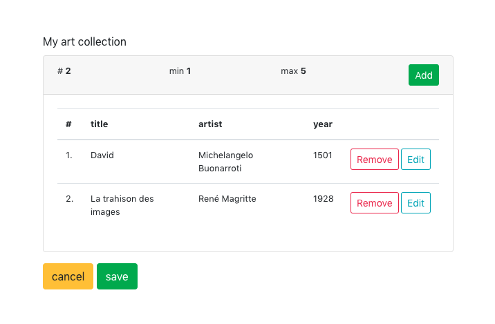
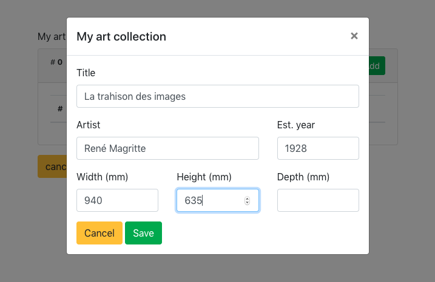

# Subform

## Setup

```js
const subformElement = [{
  type: 'subform',
  name: 'artworks',
  label: 'My art collection',
  attributes: {
    min: 1,
    max: 5,
    columns: ['title', 'artist', 'year']
  },
  elements: [
    {
      type: 'text',
      name: 'title',
      label: 'Title'
    },
    {
      type: 'text',
      name: 'artist',
      label: 'Artist'
    },
    {
      type: 'number',
      name: 'year',
      label: 'Est. year'
    },
    {
      type: 'number',
      name: 'size.width',
      label: 'Width (mm)'
    },
    {
      type: 'number',
      name: 'size.height',
      label: 'Height (mm)'
    },
    {
      type: 'number',
      name: 'size.depth',
      label: 'Depth (mm)'
    }
  ]
}]
```

This setup would create someting like this:




## Configuration

key | required | type | notes
--- | --- | --- | ---
elements | yes | [Object] | any form configuration<br>form will be available in a modal
attributes.min | no | Number | Visual reminder of minimal amount of items.
attributes.max | no | Number | Visual reminder of maximal amount of items.<br>Prevents adding new items when this limit is reached.
attributes.columns | no | [String] | Selection of fields to show in the overview.<br>Fields refer to `name` of elements of subform.

## Value

```js
const model = {
  artworks: [
    {
      title: 'David',
      artist: 'Michelangelo Buonarroti',
      year: 1501,
      size: {
        height: 5170
      }
    }, {
      title: 'La trahison des images',
      artist: 'René Magritte',
      year: 1928,
      size: {
        width: 940,
        height: 635
      }
    }
  ]
}
```
