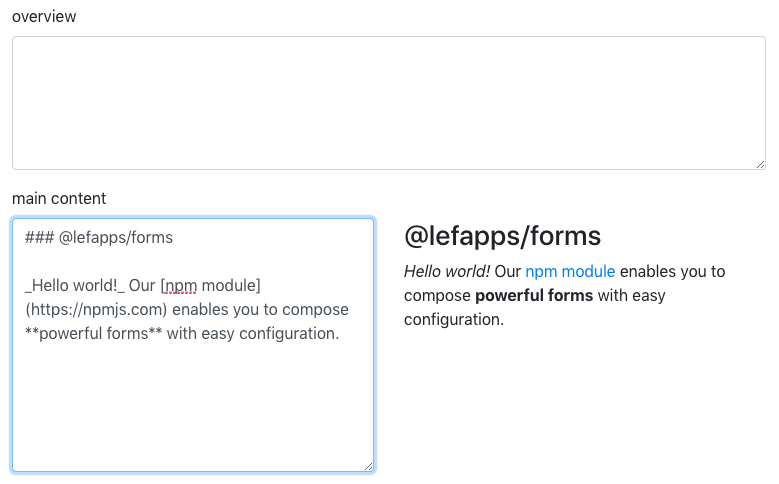

# Textarea

## Setup

```js
const subformElement = [{
  type: 'textarea',
  name: 'content',
  label: 'Your article',
  attributes: { rows: 5 },
  md: true
}]
```

## Configuration

key | required | type | notes
--- | --- | --- | ---
attributes.rows | no | Number | Html attribute to control the initial height of the textarea
md | no | Bool | When present, a live preview next to the form will be visible<br/>(available MD-plugins: `markdown-it-video`, `markdown-it-attrs`)



## Preview (markdown)

The markdown preview gets classes for styling:

```html
<div /> <!--contains textarea, its label and other decorator components-->
<div class="md-preview">
  <div class="md-preview-content">
    <!--Preview content (html)-->
  </div>
</div>
```
